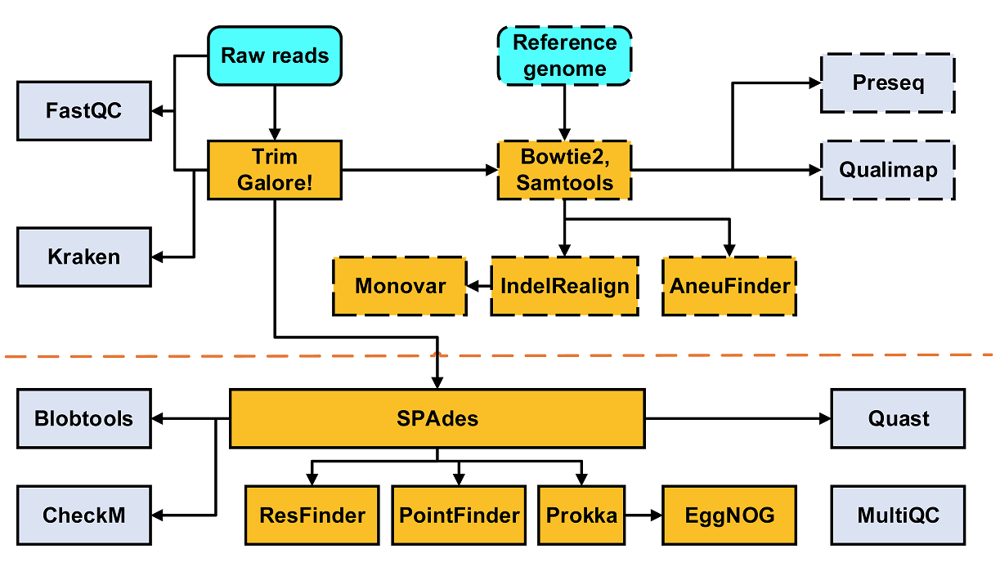

# gongyh/nf-core-scgs

**Single Cell Genome Sequencing data analysis pipeline**.

[](https://travis-ci.org/gongyh/nf-core-scgs)
[](https://circleci.com/gh/gongyh/nf-core-scgs)
[](https://www.nextflow.io/)<!-- [](https://hub.docker.com/r/gongyh/scgs) -->
[](https://quay.io/repository/gongyh/nf-core-scgs)

## Introduction
The pipeline is used for single cell genome sequencing data analysis and built using [Nextflow](https://www.nextflow.io), a workflow tool to run tasks across multiple compute infrastructures in a very portable manner. It comes with docker / singularity containers making installation trivial and results highly reproducible.



## Quick start
0. Prerequisites: 
Git, Java 8 or later, Docker
```bash
## Install Nextflow
$ curl -s https://get.nextflow.io | bash
## Pull docker container
$ docker pull gongyh/scgs:v1.0-rc
## Get the pipeline
$ git clone https://github.com/gongyh/nf-core-scgs.git
## Test (16 cpus, 48G memory)
$ ./nextflow run nf-core-scgs -profile test_local,docker
```

## Documentation
The gongyh/nf-core-scgs pipeline comes with documentation about the pipeline, found in the `docs/` directory:

1. [Installation](docs/installation.md)
2. Pipeline configuration
    * [Local installation](docs/configuration/local.md)
    * [Adding your own system](docs/configuration/adding_your_own.md)
    * [Reference genomes](docs/configuration/reference_genomes.md)  
3. [Running the pipeline](docs/usage.md)
4. [Output and how to interpret the results](docs/output.md)
5. [Troubleshooting](docs/troubleshooting.md)

<!-- TODO nf-core: Add a brief overview of what the pipeline does and how it works -->

## Related publications
[1]  Xu, T., Gong, Y., Su, X., Zhu, P., Dai, J., Xu, J., Ma, B., Phenome–Genome Profiling of Single Bacterial Cell by Raman‐Activated Gravity‐Driven Encapsulation and Sequencing. *Small* 2020, 2001172. [https://doi.org/10.1002/smll.202001172](https://doi.org/10.1002/smll.202001172) [Details](https://github.com/gongyh/nf-core-scgs/blob/master/RAGE-Seq/Data.md)

[2] Su, X., Gong, Y., Gou, H., Jing, X., Xu, T., Zheng, X., Chen, R., Li, Y., Ji, Y., Ma, B., Xu, J., Rational Optimization of Raman-Activated Cell Ejection and Sequencing for Bacteria. *Analytical Chemistry*, 2020. [https://doi.org/10.1021/acs.analchem.9b05345](https://doi.org/10.1021/acs.analchem.9b05345)

## Credits
gongyh/nf-core-scgs is maintained by [Yanhai Gong](mailto:gongyh@qibebt.ac.cn).

